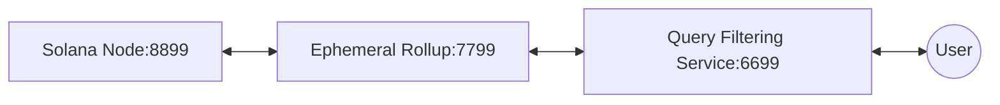

# ⚡ MagicBlock Engine - Integration Examples

Scaling solution for performant, composable games and applications.

## ✨Overview

This repository contains examples of how to use the different features available in an Ephemeral Rollup (ER).
Read more about Ephemeral Rollups [here](https://docs.magicblock.gg/EphemeralRollups/ephemeral_rollups).

> To view integrated demos for specific usecases, please look at [MagicBlock Starter Kits](https://github.com/magicblock-labs/starter-kits).

## 👷 Examples

### 🧱 Basic Examples

Core feature demos like delegation, randomness and privacy - the place to start.

<table>
<tr>
<td valign="top" width="33%">
<blockquote>
<p><strong><a href="./anchor-counter/">➕ Anchor Counter</a></strong></p>
<p>

</p>
<p><em>Counter program in Anchor.</em></p>
</blockquote>
</td>
<td valign="top" width="33%">
<blockquote>
<p><strong><a href="./rust-counter/">🦀 Rust Counter</a></strong></p>
<p>

</p>
<p><em>Counter program in native Rust.</em></p>
</blockquote>
</td>
<td valign="top" width="33%">
<blockquote>
<p><strong><a href="./pinocchio-counter/">🪵 Pinocchio Counter</a></strong></p>
<p>

</p>
<p><em>Counter program built with Pinocchio.</em></p>
</blockquote>
</td>
</tr>
<tr>
<td valign="top" width="33%">
<blockquote>
<p><strong><a href="./private-counter/">🔒 Anchor Private Counter</a></strong></p>
<p>


</p>
<p><em>Anchor counter with permissions.</em></p>
</blockquote>
</td>
<td valign="top" width="33%">
<blockquote>
<p><strong><a href="./pinocchio-private-counter/">🪵 Pinocchio Private Counter</a></strong></p>
<p>


</p>
<p><em>Pinocchio counter with magic permission accounts.</em></p>
</blockquote>
</td>
<td valign="top" width="33%">
<blockquote>
<p><strong><a href="./spl-tokens/">💰 SPL Tokens</a></strong></p>
<p>


</p>
<p><em>SPL token delegation example with transfers on the ER.</em></p>
</blockquote>
</td>
</tr>
<tr>
<td valign="top" width="33%">
<blockquote>
<p><strong><a href="./dummy-token-transfer/">🪙 Dummy Token Transfer</a></strong></p>
<p>


</p>
<p><em>Dummy SPL token onboarding.</em></p>
</blockquote>
</td>
<td valign="top" width="33%">
<blockquote>
<p><strong><a href="./roll-dice/">🎲 Roll Dice</a></strong></p>
<p>


</p>
<p><em>Dice roll using a verifiable random function (VRF) on the ER.</em></p>
</blockquote>
</td>
<td valign="top" width="33%">
<blockquote>
<p><strong><a href="./pinocchio-roll-dice/">🎲 Pinocchio Roll Dice</a></strong></p>
<p>


</p>
<p><em>Pinocchio VRF dice variant.</em></p>
</blockquote>
</td>
</tr>
</table>

### 🧩 Feature Examples

Focused demos of individual capabilities — on-curve delegation, actions, ephemeral accounts, cranks, sessions.

<table>
<tr>
<td valign="top" width="33%">
<blockquote>
<p><strong><a href="./oncurve-delegation/">📈 On-Curve Delegation</a></strong></p>
<p>


</p>
<p><em>Delegate on-curve accounts to the ER and manage their lifecycle.</em></p>
</blockquote>
</td>
<td valign="top" width="33%">
<blockquote>
<p><strong><a href="./magic-actions/">✨ Magic Actions</a></strong></p>
<p>


</p>
<p><em>Execute base-chain actions from inside an Ephemeral Rollup.</em></p>
</blockquote>
</td>
<td valign="top" width="33%">
<blockquote>
<p><strong><a href="./delegation-actions/">✨ Delegation Actions</a></strong></p>
<p>


</p>
<p><em>Attach actions that the ER runs automatically right after delegation.</em></p>
</blockquote>
</td>
</tr>
<tr>
<td valign="top" width="33%">
<blockquote>
<p><strong><a href="./ephemeral-account-chats/">💬 Ephemeral Account Chats</a></strong></p>
<p>


</p>
<p><em>Anchor chat program using "magic accounts" (ER-only).</em></p>
</blockquote>
</td>
<td valign="top" width="33%">
<blockquote>
<p><strong><a href="./crank-counter/">⏱️ Crank Counter</a></strong></p>
<p>


</p>
<p><em>Counter driven by MagicBlock's scheduled crank system.</em></p>
</blockquote>
</td>
<td valign="top" width="33%">
<blockquote>
<p><strong><a href="./session-keys/">🔑 Session Keys</a></strong></p>
<p>


</p>
<p><em>Counter using gpl-session keys for delegated-signer auth on both base chain and ER.</em></p>
</blockquote>
</td>
</tr>
</table>

### 🎨 Templates

End-to-end app templates you can fork and build on.

<table>
<tr>
<td valign="top" width="33%">
<blockquote>
<p><strong><a href="./private-payments/">🛡️ Private Payments</a></strong></p>
<p>


</p>
<p><em>Next.js demo for MagicBlock private payments.</em></p>
</blockquote>
</td>
<td valign="top" width="33%">
<blockquote>
<p><strong><a href="./rewards-delegated-vrf/">🏆 Rewards (Delegated VRF)</a></strong></p>
<p>


</p>
<p><em>Rewards distribution program using delegated VRF.</em></p>
</blockquote>
</td>
<td valign="top" width="33%">
<blockquote>
<p><strong><a href="./rock-paper-scissor/">✊ Rock Paper Scissor</a></strong></p>
<p>


</p>
<p><em>Two-player RPS with hidden moves on the ER until reveal.</em></p>
</blockquote>
</td>
</tr>
<tr>
<td valign="top" width="33%">
<blockquote>
<p><strong><a href="./gachapon-example/">🪄 Magic Gachapon</a></strong></p>
<p>


</p>
<p><em>MagicBlock VRF gachapon demo that mints a Metaplex Core NFT reward.</em></p>
</blockquote>
</td>
</tr>
</table>

## Testing

To run local tests for any example project, use the following steps:

1. **Install Dependencies (Local nodes + example directory):**

   ```bash
   npm install -g @magicblock-labs/ephemeral-validator@latest
   cd <example-directory>
   yarn install
   ```

2. **Setup local nodes:**

   ```bash
   yarn setup
   ```

3. **Run Tests Locally:**
   ```bash
   yarn test:local
   ```

**Example:** To test the `pinocchio-roll-dice` example:

```bash
cd pinocchio-roll-dice
yarn build
yarn test:local
```

### Local nodes

Setting up local nodes:

- A Solana Test Validator preloaded with all the needed programs to work with ER.
- A local Ephemeral Rollup.
- The Query Filtering Service that replicates the privacy logic happening on TEE nodes, without hardware attestation.



Set the endpoint to the QFS if you want to test privacy features, or to the ER directly otherwise.

## Backward Compatibility

Older pre-Anchor 1.0 versions of the migrated programs are kept in
[00-LEGACY_EXAMPLES](./00-LEGACY_EXAMPLES/README.md). The `00-` prefix keeps
these compatibility references listed before the active examples in
alphabetical folder views. These examples are for users who still need the
previous Anchor 0.32.1 implementations while upgrading to the current Anchor 1.0
programs.
